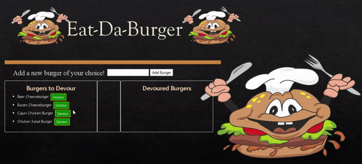

# Eat-Da-Burger

Eat-Da-Burger is a restaurant app that lets users input the names of burgers they'd like to eat.

A full stack application with the front end implemented with Handlebars, CSS, and Bootstrap, and the back end with Node.js and Express. Data is stored in a MySQL database. HTML templating is done handled with the use of Handlebars.

This application follows the MVC (model view controller) framework. The app utilizes express routing, handlebars.js, and stores data in a MySQL database. It is is very simple - there are two columns listed as "burgers ready for devouring," and "devoured burgers." Burgers listed as ready to be devoured have a button next to them called Devour! Clicking this will move the burger into the devoured burgers column.


## Demo



## Description
A burger logger with MySQL, Node, Express, Handlebars and a homemade ORM.


## Table of Contents
* [Getting Started](#Getting-Started)
* [Credits](#credits)
* [Technologies](#Technologies)
* [Directory structure](#Directory-structure)

## Getting Started

The application will be invoked with the following command: node app.js. 

```sh
npm install
Create MySQL Database as per the db file making necessary alternations in connections file
   `then run npm install`
   lastly 
node server.js


* Whenever a user submits a burger's name, the app will display the burger on the
 left side of the page -- waiting to be devoured.

* Each burger in the waiting area also has a `Devour it!` button. When the user
 clicks it, the burger will move to the right side of the page.

* Your app will store every burger in a database, whether devoured or not till it is deleted.


# Technologies
The app's database schema and seeds were created in the MySQL workbench, and the coding was done in VS Code using node.js, JavaScript, handlebars.js, and Express. A custom ORM was also utilized. CSS, Bootstrap and Google Fonts were used for the styling of the app.

# Directory structure

All the recommended files and directories from the steps above should look like the following structure:

```
.
├── config
│   ├── connection.js
│   └── orm.js
│ 
├── controllers
│   └── burgers_controller.js
│
├── db
│   ├── schema.sql
│   └── seeds.sql
│
├── models
│   └── burger.js
│ 
├── node_modules
│ 
├── package.json
│
├── public
│   └── assets
│       ├── css
│       │   └── burger_style.css
│       └── img
│           └── burger.png
│   
│
├── server.js
│
└── views
    ├── index.handlebars
    └── layouts
        └── main.handlebars
```


